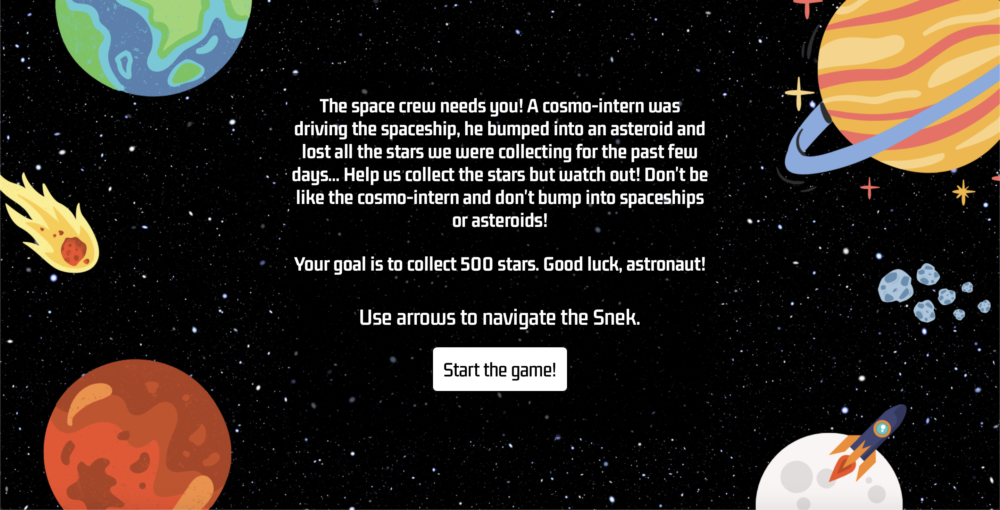

# All you need to know about SPACE SNEK

The user's spaceship is going to move like a snake but it's not going to become longer. That's also why the game is called snek, not snake.

The user is going to collect items and after each collection the score will become bigger.

The goal is to collect 500 stars (which means collecting 50 items, 1 item = 10 stars).

After collecting 300 stars, there will be a change in colors so the user must adapt.

After collecting 400 stars, the arrows switch (when the user clicks right arrow, the snek will go right etc.).

The user must avoid collision with other spaceships and asteroids.

Good luck!

[Play the game here](link)

